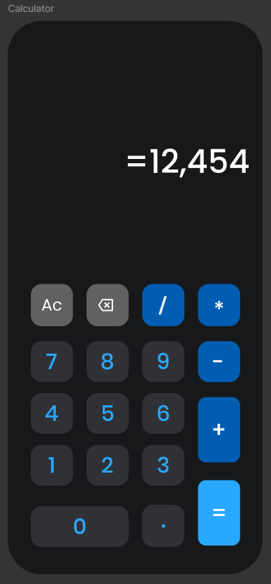

# 🧮 Calculator App

A simple and clean calculator app built using Flutter.

---

## 📱 Screenshots



---

## 🚀 Features

- Basic operations (+ - * /)
- Clean UI
- Responsive design
- Delete last input (X button)
- Clear all (AC)

---

## 🛠️ Tech Used

- Flutter
- Dart

---

## 📂 Project Structure
```
lib/
├── main.dart          # App entry point
├── calculator.dart    # Calculator screen
└── button.dart        # Custom button widget
```

---

## 🎨 Colors

- Background: #17181A
- Gray: #616161
- Black Gray: #303136
- Blue: #005DB2
- Light Blue: #29A8ff

---

## 🤝 Contributing

Contributions are always welcome!

---

## 👨‍💻 Author

- **Mohamed Shaaban**

---


